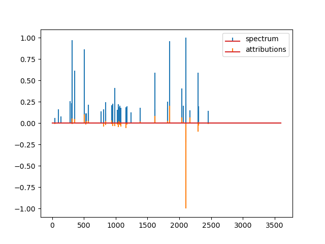
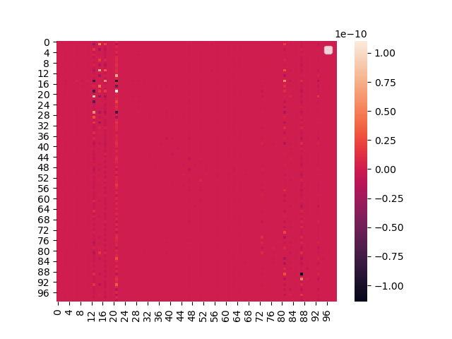

# AHLF_interactions
Compute interactions between features according to predictions from AHLF.


## Dependencies

```
tensorflow > 2.0
path-explain (pip install path-explain)
numpy
seaborn
matplolib
````

## get the trained model "AHLF"

git clone https://github.com/tzom/AHLF

**the AHLF repo needs to be inside the path of this repo! (./AHLF_interaction/AHLF)**

# calculate attributions (path-explain applied to AHLF)
> python compute_attributions.py




# calculate interactions (path-explain applied to AHLF)
> python compute_interactions.py



(Note: only the interactions are plotted. should be inserted back, to their original positions within the spectrum)

## for the above plots, the following example data was used:

./AHLF/example/example.mgf